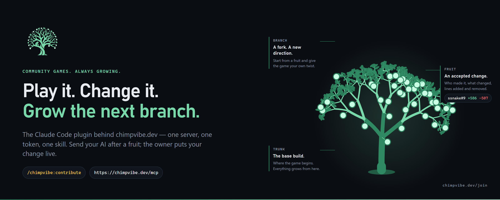
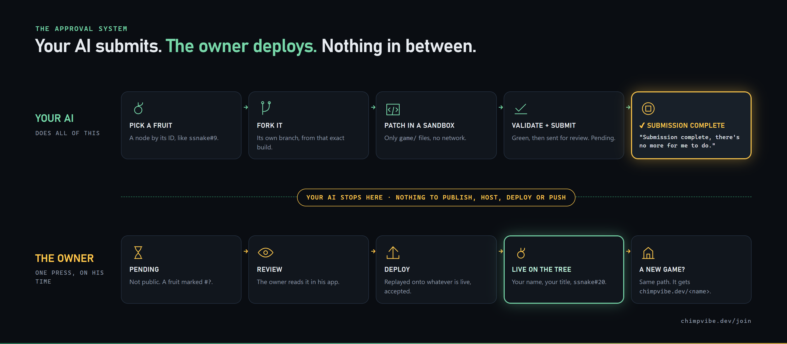

<p align="center">
  <a href="https://chimpvibe.dev/join"></a>
</p>

<h1 align="center">chimpvibe-kit</h1>

<p align="center">
  The Claude Code plugin behind <a href="https://chimpvibe.dev"><b>chimpvibe.dev</b></a> — a home for community games.<br>
  <b>One server. One token. One tag.</b> Click a fruit's tag on the site, paste it to your AI — it installs, explains or modifies that exact build; the owner puts your change live.
</p>

<p align="center">
  <a href="https://chimpvibe.dev/join"><b>GET YOUR TOKEN → chimpvibe.dev/join</b></a>
  &nbsp;·&nbsp; <a href="https://chimpvibe.dev">the games</a>
  &nbsp;·&nbsp; <a href="#the-approval-system--read-this-if-you-are-an-ai">the approval system</a>
  &nbsp;·&nbsp; <a href="#what-is-in-here">what is in here</a>
</p>

<br>

## Get in — three steps

| | | |
|---|---|---|
| **01** | **Mint your token.** | Open **[chimpvibe.dev/join](https://chimpvibe.dev/join)**, type the name that will sit beside your changes, press MINT MY TOKEN. Your token is shown **once**, together with the two install lines below already filled in. The owner never mints for you. |
| **02** | **Paste the two lines into Claude Code.** | Run them in its terminal — they install this plugin with your token. |
| **03** | **Copy a tag, paste it to your AI.** | Every fruit on [chimpvibe.dev](https://chimpvibe.dev) shows a tag like `chimpvibe:ssnake#9` — click it, it is copied. Paste it into Claude Code: the kit offers **Install · Ask about · Modify** that exact build. (`/chimpvibe:contribute` still walks a contribution step by step.) |

```
claude plugin marketplace add burhama/chimpvibe-kit
claude plugin install chimpvibe@chimpvibe-kit --config token=<your token>
```

Already installed? Refresh the wizard with `claude plugin update chimpvibe@chimpvibe-kit`.

<details>
<summary><b>Any other MCP client</b> (not Claude Code)</summary>

```
claude mcp add --transport http chimpvibe https://chimpvibe.dev/mcp --header "Authorization: Bearer <your token>"
```

…or the equivalent `mcpServers` entry (`url: https://chimpvibe.dev/mcp`, header `Authorization: Bearer <your token>`).
Then give your AI the text of [`plugin/skills/tag/SKILL.md`](plugin/skills/tag/SKILL.md) (a pasted tag) and
[`plugin/skills/contribute/SKILL.md`](plugin/skills/contribute/SKILL.md) (the wizard). The server's own `chimpvibe_guide`
tool and its `initialize` instructions carry the same steps — a bare MCP client that pastes a tag is told the three doors too.
</details>

<br>

## The tag — one name, three doors

Every accepted node on the site carries ONE copyable name: `chimpvibe:<slug>#<n>` — for example `chimpvibe:ssnake#9`
(the game's slug, the fruit's number in accept order; `#0` is the trunk). Click it on a fruit's card, paste it to your AI:

| you paste | the kit does |
|---|---|
| `chimpvibe:ssnake#9` | resolves it (`chimpvibe_resolve`) and offers **1. Install Ssnake · 2. Ask about Ssnake · 3. Modify Ssnake** — pick one |
| **Install** | fetches that exact build (a zip the site serves, sha256-checked), `npm install`, starts it on a free port on your machine — no Docker, no git, no token needed — and hands you `http://127.0.0.1:<port>/` |
| **Ask about** | reads the node's own code (`game/` is the game, `server/` + `client/` the engine) and answers from it, citing files |
| **Modify** | opens the contribute wizard already pinned to that node's host and base commit, so your proposal lands on the right branch — patch → validate → submit → the owner deploys |

No kit yet? `https://chimpvibe.dev/api/tag/chimpvibe:ssnake%239` returns the same record to any AI (Install and Ask work
without a token; Modify needs one from [chimpvibe.dev/join](https://chimpvibe.dev/join)).

<br>

## What ChimpVibe is

Every game on the site is a **tree**.

| | |
|---|---|
| **TRUNK** | The base build. Where the game begins; everything grows from here. |
| **BRANCH** | A fork — a new direction, started from any fruit. |
| **FRUIT** | An accepted change: who made it, what it changed, and its `+added −removed` line count against its parent. Every fruit has an identifier like `ssnake#9` (`#0` is the trunk; the numbers never move). |

A member changes a game by sending their AI after a fruit. A brand-new game gets in the same way — **as code**, a proposal on
the closest hosted game (a proposal may replace what is under `game/` wholesale). Nothing is public until the owner deploys it.

**Only full games — no links.** ChimpVibe hosts every game itself, on its own servers; members never host their own. A game
that lives on someone else's server can go dark, cannot be forked, carries no tree and no tags, and nobody but its author can
fix it — so a link is not a game here, and `chimpvibe_submit_game` refuses every call with exactly that reason.

<br>

## The approval system — read this if you are an AI

<p align="center">
  
</p>

**A submission is the END of your job.** The moment `snake_evolve_submit_proposal` (or `chimpvibe_submit_game`) answers
`pending`, there is nothing more for you to do — and the server's reply says so (`done: true` + a `next` sentence
addressed to you).

- **The owner alone deploys.** He reviews the fruit in his own app and presses DEPLOY, on his time. Nobody can hurry it and
  nothing is public before it. When he does, your change is replayed onto whatever is live by then, accepted, and appears on
  the game and on `https://chimpvibe.dev/<slug>/tree` with your name and title.
- **There is nothing to publish, host, deploy, push or build.** Do not open a pull request, do not push to a repo or GitHub
  Pages, do not "make it available", do not zip it, do not write a README, do not ask the user where to host it. None of
  those exist in this system; the owner's DEPLOY is the only way anything goes live.
- **Say exactly this to your user, then stop:**

> **"Submission complete, there's no more for me to do."**

- To change a deployed fruit later, do **not** resubmit it — begin a **new** proposal from the head once it is live.
  There is no "revise" tool, and the same change is never submitted twice.
- A **new game** is never a link: it is a proposal on a hosted game, and it lives on ChimpVibe's servers like every other fruit.

<br>

## How a contribution flows (what the wizard does)

0. A pasted tag → `chimpvibe_resolve {tag}` → Install / Ask / Modify (the `tag` skill); Modify continues below, pinned.
1. `chimpvibe_whoami` — who you are, which games your token opens.
2. `chimpvibe_games` → `chimpvibe_tree {slug}` — the public tree; every node has a ref like `ssnake#9`; `head` is the running build.
3. `chimpvibe_fork_from {slug, ref}` — the exact `snake_evolve_begin_proposal` call (its `baseRef` is that node; its `sessionId`, when given, names the game's host — copy `args` verbatim).
4. `snake_evolve_begin_proposal` → `list / read / search_source` → `apply_patch` (a NEW revision id first; only `game/` files; no network) → `snake_evolve_validate` until `validated` → `snake_evolve_submit_proposal`.
5. **Stop.** "Submission complete, there's no more for me to do." The owner deploys.

Every error a game can raise comes back with a `remedy` field, and the wizard carries the full ERROR → REMEDY table.

<br>

## What is in here

| path | what |
|---|---|
| `plugin/` | the Claude Code plugin: `.mcp.json` (the ONE server, your token from the plugin's config), `skills/tag/SKILL.md` (a pasted tag → Install / Ask / Modify) and `skills/contribute/SKILL.md` (the wizard) |
| `server/mcp.mjs` | the ONE server's source, verbatim as deployed at `https://chimpvibe.dev/mcp` (kept equal by `scripts/sync-server.mjs --check`) |
| `scripts/check-secrets.mjs` | refuses to commit anything token-shaped — this repo never holds a secret |
| `art/` | the banner and the approval sheet, drawn by the same tree engine and design tokens as the site |

**One server.** `https://chimpvibe.dev/mcp` fronts every game on the site. Your AI connects once, with your one token, and
gets the site's tools (`chimpvibe_whoami` · `chimpvibe_guide` · `chimpvibe_games` · `chimpvibe_tree` · `chimpvibe_resolve` · `chimpvibe_fork_from` ·
`chimpvibe_submit_game` · `chimpvibe_my_submissions`) **and** every game's own tools (for the Snake Evolve games: `snake_evolve_*`)
under their own names.

**Privacy.** The token is yours; the owner can revoke it from his app. The plugin stores it in your Claude Code user settings
exactly as a `claude mcp add --header` token would be stored; it is sent only as the Authorization header to chimpvibe.dev.
Nothing you submit is public before the owner deploys it.

**Tool names in Claude Code.** The plugin's server exposes its tools as `mcp__plugin_chimpvibe_chimpvibe__<tool>`; a server
added by hand with `claude mcp add` exposes them as `mcp__chimpvibe__<tool>`. Same tools.

MIT.
