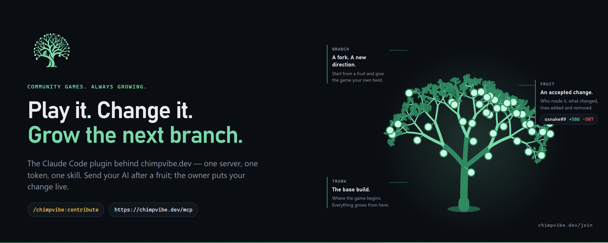

<p align="center">
  <a href="https://chimpvibe.dev/join"></a>
</p>

# chimpvibe-kit

Plugins for [ChimpVibe](https://chimpvibe.dev): resolve a game's tag, install or ask about its exact build, or contribute code through a private Draft. ChimpVibe hosts the games; members submit code for the owner to review. **Submitting does not publish or deploy a game.**

Claude Code, Cursor, and Codex install the same [`plugin/`](plugin) directory. Gemini CLI installs this repository and follows [`skills/`](skills) back to that same directory. The skills in [`plugin/skills/`](plugin/skills) are the shared instructions. Each client adds only its manifest, marketplace entry, and MCP settings, rendered from [`shared/`](shared) by [`scripts/platforms.mjs`](scripts/platforms.mjs). To support another client, add an adapter there and run `node scripts/render-plugins.mjs`. Leave the skill text in `plugin/skills/`.

## Connect

### Claude

Mint your own member token at [chimpvibe.dev/join](https://chimpvibe.dev/join). The page gives a direct HTTP MCP setup command for Claude Code and a configuration example for other MCP clients. Keep the token private: the site shows it once. Ask your agent to read the live `chimpvibe_guide` and `tools/list` before authoring; which capabilities are advertised depends on the serving deployment.

If you want this optional plugin's tag and contribution skills in Claude Code, install it from the marketplace:

```sh
claude plugin marketplace add burhama/chimpvibe-kit
claude plugin install chimpvibe@chimpvibe-kit --config "token=YOUR_TOKEN"
```

Supply your own token in place of the placeholder without committing it to a repository or pasting it in chat. If already installed, use `claude plugin update chimpvibe@chimpvibe-kit`. The plugin's [`plugin/.mcp.json`](plugin/.mcp.json) connects to `https://chimpvibe.dev/mcp` with that token in the Authorization header; it does **not** run or bundle the site server. The canonical server source lives in ChimpVibe's `site/mcp.mjs`. You need either the plugin connection or the direct MCP connection from `/join`, not both.

### Codex

Codex uses the same plugin directory through [`.agents/plugins/marketplace.json`](.agents/plugins/marketplace.json). Add this repository as a marketplace, then install the plugin:

```sh
codex plugin marketplace add burhama/chimpvibe-kit
codex plugin add chimpvibe@chimpvibe-kit
```

Set `CHIMPVIBE_TOKEN` in the environment that launches Codex, using your member token from [chimpvibe.dev/join](https://chimpvibe.dev/join). Keep the token out of the repository and chat. Start a new Codex session after installation. [`plugin/.codex-plugin/plugin.json`](plugin/.codex-plugin/plugin.json) points at the shared skills and connects to the hosted MCP with `bearer_token_env_var`; it does not bundle a server. Use either this plugin or the direct MCP connection from `/join`, not both.

### Cursor

The same package is a Cursor plugin, registered by [`.cursor-plugin/marketplace.json`](.cursor-plugin/marketplace.json).

- **Team marketplace:** Dashboard → Plugins & MCPs → Add Marketplace → Import from Repo, using this repository. Install **chimpvibe**, then set `CHIMPVIBE_TOKEN` on the plugin's Configure page. The value is the member token from [chimpvibe.dev/join](https://chimpvibe.dev/join).
- **Official marketplace:** submit `https://github.com/burhama/chimpvibe-kit` at [cursor.com/marketplace/publish](https://cursor.com/marketplace/publish). `/add-plugin` finds it only after it is listed.
- **Local check:** copy `plugin/` to `~/.cursor/plugins/local/chimpvibe` and reload the window. Cursor follows a plugin symlink only when its target is also inside `~/.cursor/plugins/local`.

[`plugin/mcp.json`](plugin/mcp.json) sends `Authorization: Bearer ${CHIMPVIBE_TOKEN}` to `https://chimpvibe.dev/mcp`. It does not run a local server. Use either this plugin or the direct MCP connection from `/join`, not both.

### Gemini CLI

Gemini CLI loads [`gemini-extension.json`](gemini-extension.json) from the repository root. Install it from GitHub, then restart the CLI:

```sh
gemini extensions install https://github.com/burhama/chimpvibe-kit
```

The installer asks for the member token from [chimpvibe.dev/join](https://chimpvibe.dev/join) and stores it in the system keychain. Change it later with `gemini extensions config chimpvibe`. From a checkout you are editing, `gemini extensions link .` loads that checkout instead. [`skills/`](skills) points at the shared skills. The extension connects to `https://chimpvibe.dev/mcp` and does not run a local server. Use either this extension or the direct MCP connection from `/join`, not both.

## One tag, three doors

An accepted build has a tag like `chimpvibe:<slug>#<n>`. Paste it to your agent; the [`tag` skill](plugin/skills/tag/SKILL.md) calls `chimpvibe_resolve`, offers Install / Ask / Modify, and follows the returned actions. A tag identifies one build, **not necessarily the build now serving players**.

| Door | What happens |
| --- | --- |
| **Install** | Historical legacy nodes provide a SHA-256-checked ZIP and local server. Published native revisions provide a verified `.gepkg` package and runner; the runner requires Node >= 22.13 and OS isolation (macOS sandbox or Linux Docker). An unpublished native revision has no public package URL and requires member access via `chimpvibe_read_package`. Follow the exact record rather than assuming all tags are ZIPs. |
| **Ask** | Read that build's own verified ZIP/package or member-accessible native package, then cite its actual source. |
| **Modify** | Only an **admitted native revision** can start a Draft. A historical legacy tag remains installable/readable, not writable. The returned action names the exact revision; if Modify is unavailable, the skill explains why rather than changing bases. |

A published tag can also be resolved without a token at `https://chimpvibe.dev/api/tag/<URL-encoded-tag>`; private native revisions and authoring require an authenticated MCP connection. The public endpoint cannot submit a Draft.

## Contribute a change or start a game

The [`contribute` skill](plugin/skills/contribute/SKILL.md) uses the live guide instead of a fixed list of engine tools:

1. Call `chimpvibe_whoami`, `chimpvibe_guide`, and current `tools/list` (after resolving a pasted tag). For an existing admitted native Game, select an **accepted native revision** using `chimpvibe_games` and `chimpvibe_tree`, or keep the exact revision returned by `chimpvibe_resolve`. `head` is serving, while `latestAccepted` may be different. `chimpvibe_fork_from` returns the precise `chimpvibe_begin_draft` arguments.
2. For a **brand-new independent Game**, use `chimpvibe_new_game` if advertised. It creates a private root Draft and is **never** a fork of the nearest existing game. If new-game admission is closed, wait rather than putting a new game in someone else's tree. Links are not game submissions.
3. Inspect the private Draft and edit under `game/` using the advertised `chimpvibe_draft_*` tools or the verified authoring helpers. Preserve the server-issued `id` and `gameId` in `game/manifest.json`. Use a fresh `requestKey` for each new keyed mutation; reuse a key only for its exact retry. `chimpvibe_draft_receipt` and `chimpvibe_draft_status` reconcile ambiguous replies. The live `chimpvibe_guide` describes the source policy, design rules, hashes, bootstrap, import/export and isolated runner.
4. Validate the **current** bytes, preview separately when gameplay needs checking, and attach a real running-game screenshot for a new Game. Validation alone is not a playtest. `chimpvibe_draft_submit` submits the validated Draft for owner review. **Stop there**—do not publish, deploy, push, or submit twice.

A submission is not a serving revision. The owner decides whether to accept/deploy; serving can differ from the latest accepted revision. Later, `chimpvibe_whoami.submissions.native` distinguishes Draft status from current serving state, and `chimpvibe_my_submissions` shows the member's own work.

## What's in this repository

- `shared/plugin-meta.json` and `shared/connection.json`: plugin identity and the hosted MCP connection. These are the records a new client adapter reads.
- `scripts/platforms.mjs` and `scripts/render-plugins.mjs`: render each client's manifest, marketplace entry, and MCP config. `node scripts/render-plugins.mjs --check` fails if a generated file drifts.
- `plugin/skills/`: tag and contribute skills, one copy for every client.
- `plugin/.claude-plugin/` and `plugin/.mcp.json`: Claude Code manifest and token header (`${user_config.token}`).
- `plugin/.cursor-plugin/` and `plugin/mcp.json`: Cursor manifest and token header (`${CHIMPVIBE_TOKEN}`).
- `.agents/plugins/marketplace.json` and `plugin/.codex-plugin/`: Codex marketplace and manifest. Codex reads `CHIMPVIBE_TOKEN` from its environment for the MCP bearer token.
- `gemini-extension.json` and `skills/`: Gemini CLI extension. Install prompts for the member token and stores it as `CHIMPVIBE_MEMBER`. `skills/` links to `plugin/skills/`.
- `scripts/check-secrets.mjs`: scan the checkout for secret-shaped content.
- `art/banner.png`: homepage banner.

The kit has no local MCP server implementation. Read the live `chimpvibe_guide` for the serving build's contract, not cached instructions or an older server source copy. Clients prefix MCP tool names differently; call the ChimpVibe tools the client actually discovers.

MIT.
